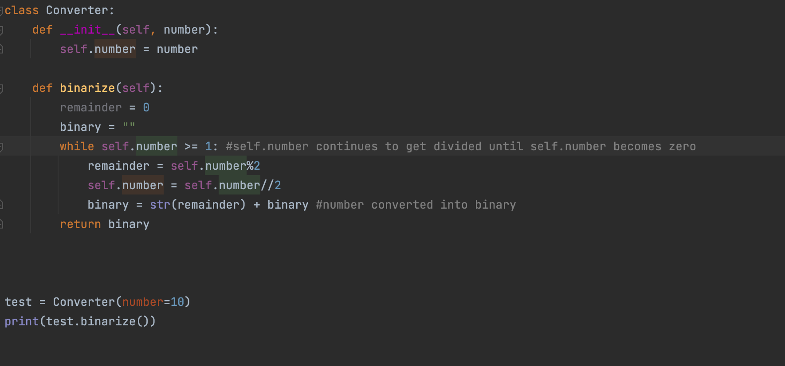

### Binary Converter

```
class Converter:
    def __init__(self, number):
        self.number = number

    def binarize(self):
        remainder = 0
        binary = ""
        while self.number >= 1: #self.number continues to get divided until self.number becomes zero
            remainder = self.number%2
            self.number = self.number//2
            binary = str(remainder) + binary #number converted into binary
        return binary
```.py


