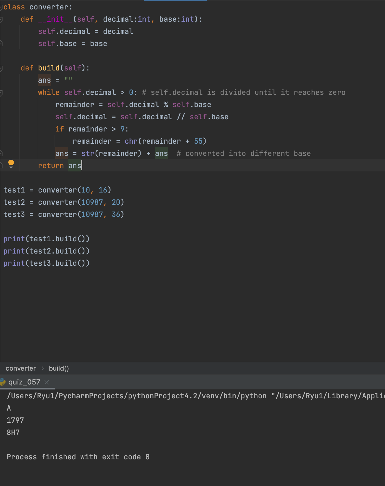

### base converter

```.py
class converter:
    def __init__(self, decimal:int, base:int):
        self.decimal = decimal
        self.base = base

    def build(self):
        ans = ""
        while self.decimal > 0: # self.decimal is divided until it reaches zero
            remainder = self.decimal % self.base
            self.decimal = self.decimal // self.base
            if remainder > 9:
                remainder = chr(remainder + 55)
            ans = str(remainder) + ans  # converted into different base
        return ans
```


