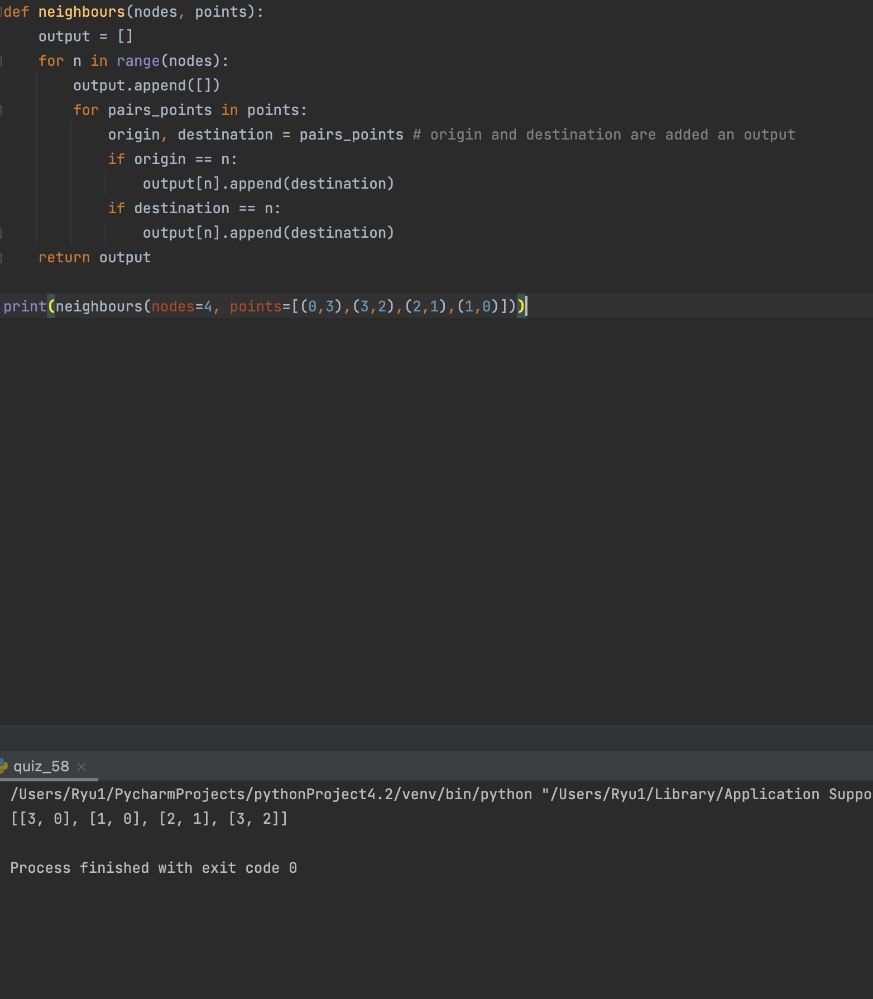

### Neighbours

```.py
def neighbours(nodes, points):
    output = []
    for n in range(nodes):
        output.append([])
        for pairs_points in points:
            origin, destination = pairs_points # origin and destination are added an output
            if origin == n:
                output[n].append(destination)
            if destination == n:
                output[n].append(destination)
    return output
```


