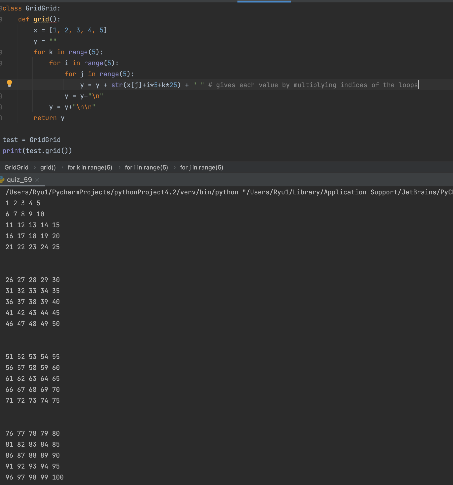

### Grid

```.py
class GridGrid:
    def grid():
        x = [1, 2, 3, 4, 5]
        y = ""
        for k in range(5):
            for i in range(5):
                for j in range(5):
                    y = y + str(x[j]+i*5+k*25) + " " # gives each value by multiplying indices of the loops
                y = y+"\n"
            y = y+"\n\n"
        return y
```


