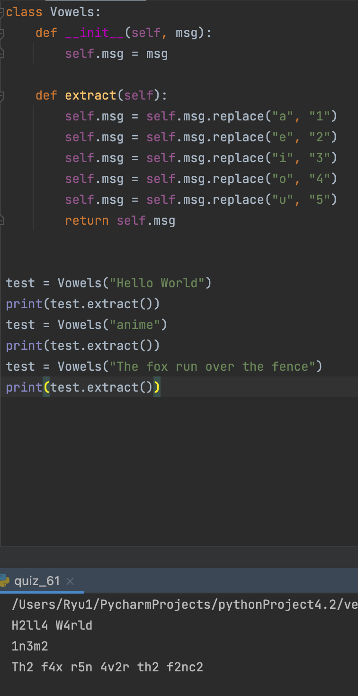

### Vowels

```.py
class Vowels:
    def __init__(self, msg):
        self.msg = msg

    def extract(self):
        self.msg = self.msg.replace("a", "1") # swapping vowels with corresponding number
        self.msg = self.msg.replace("e", "2")
        self.msg = self.msg.replace("i", "3")
        self.msg = self.msg.replace("o", "4")
        self.msg = self.msg.replace("u", "5")
        return self.msg
```


