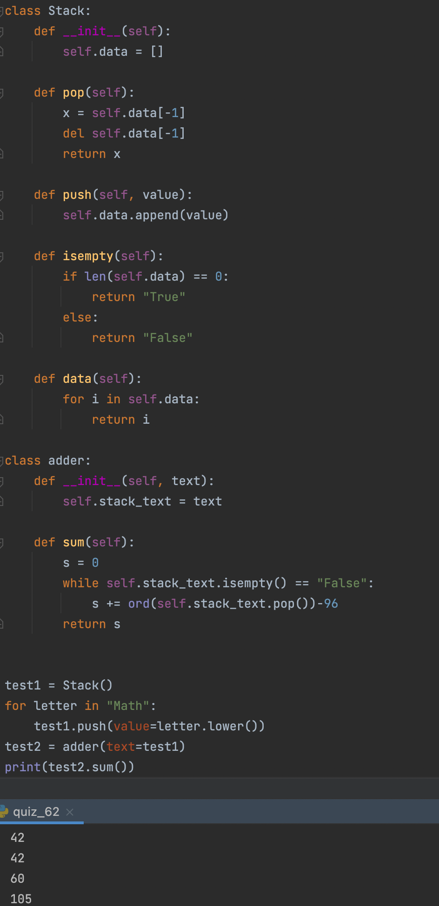

### Stack

```.py
class Stack:
    def __init__(self):
        self.data = []

    def pop(self): # outputs the last input and delete it
        x = self.data[-1]
        del self.data[-1]
        return x

    def push(self, value): # add a value to the stack
        self.data.append(value)

    def isempty(self): # verify if it is empty
        if len(self.data) == 0:
            return "True"
        else:
            return "False"

    def data(self):
        for i in self.data:
            return i

class adder:
    def __init__(self, text):
        self.stack_text = text

    def sum(self):
        s = 0
        while self.stack_text.isempty() == "False":
            s += ord(self.stack_text.pop())-96 # converting characters to corresponding numbers using ASCii
        return s
```


