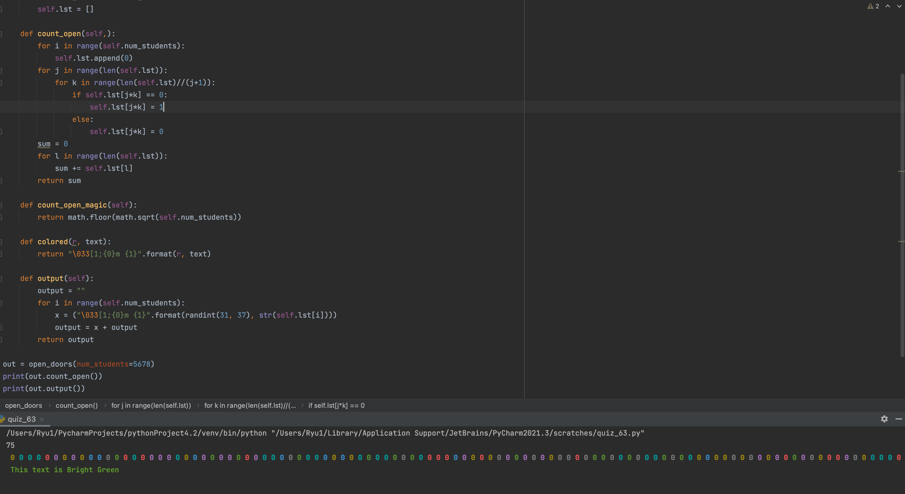

### open doors

```.py
from random import randint
import math


class open_doors:
    def __init__(self, num_students):
        self.num_students = num_students
        self.lst = []

    def count_open(self,):
        for i in range(self.num_students):
            self.lst.append(0)
        for j in range(len(self.lst)):
            for k in range(len(self.lst)//(j+1)):
                if self.lst[j*k] == 0:
                    self.lst[j*k] = 1
                else:
                    self.lst[j*k] = 0
        sum = 0
        for l in range(len(self.lst)):
            sum += self.lst[l]
        return sum

    def count_open_magic(self):
        return math.floor(math.sqrt(self.num_students))

    def colored(r, text):
        return "\033[1;{0}m {1}".format(r, text)

    def output(self):
        output = ""
        for i in range(self.num_students):
            x = ("\033[1;{0}m {1}".format(randint(31, 37), str(self.lst[i])))
            output = x + output
        return output
```


