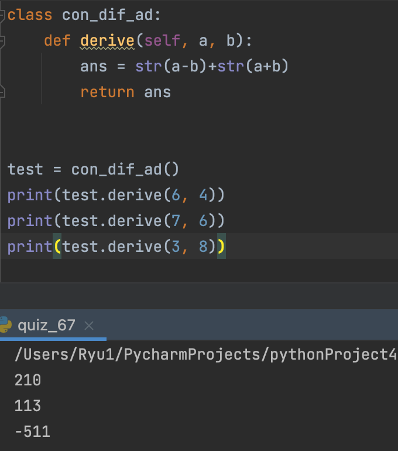

### Concatenate the remainder and the sum

```.py
class con_dif_ad:
    def derive(self, a, b):
        ans = str(a-b)+str(a+b) # The first digit of the answer is the sum of a and b and the second digit of the answer is the gap of a and b
        return ans
```


