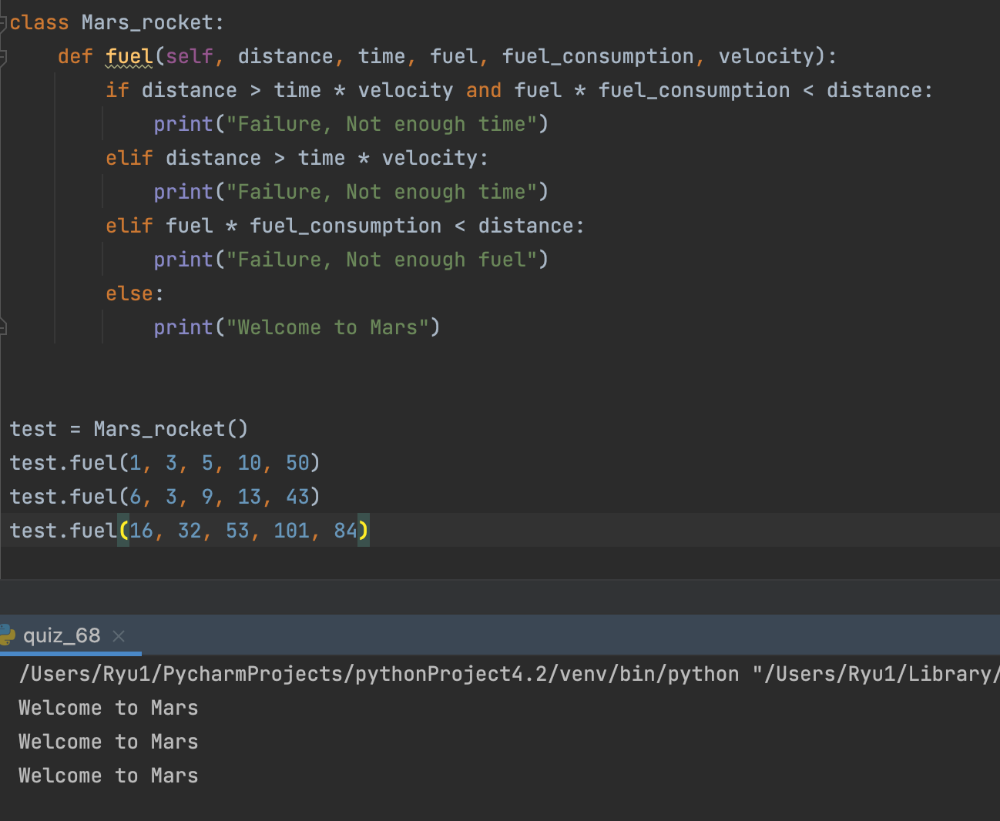

### A rocket to Mars

```.py
class Mars_rocket:
    def fuel(self, distance, time, fuel, fuel_consumption, velocity):
        if distance > time * velocity and fuel * fuel_consumption < distance:
            print("Failure, Not enough time")
        elif distance > time * velocity:
            print("Failure, Not enough time")
        elif fuel * fuel_consumption < distance:
            print("Failure, Not enough fuel")
        else:
            print("Welcome to Mars")
```


