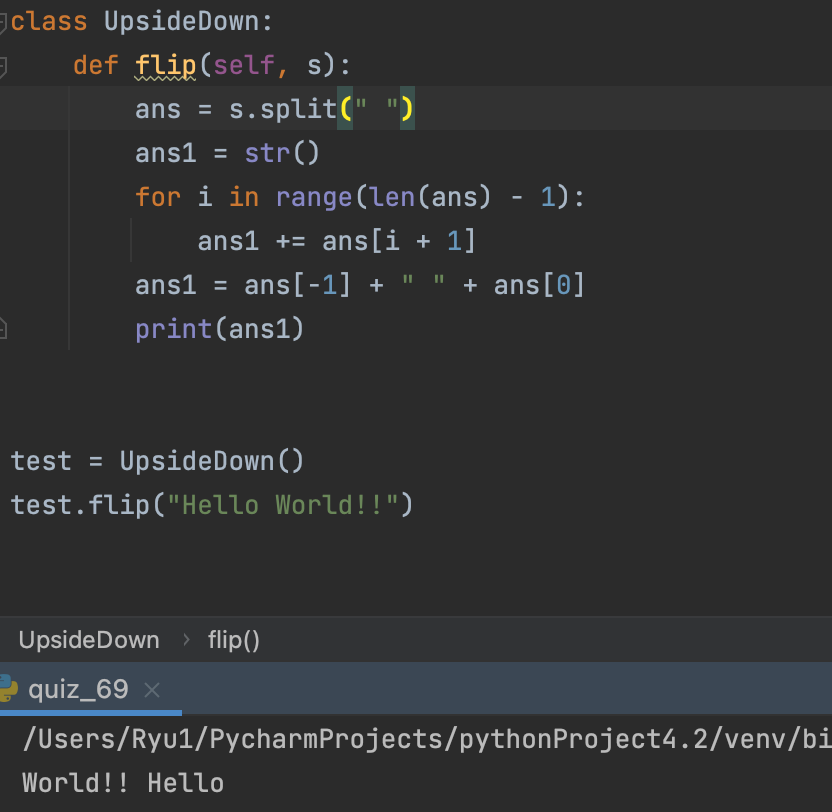

### Move the first word to the last

```.py
class UpsideDown:
    def flip(self, s):
        ans = s.split(" ")
        ans1 = str()
        for i in range(len(ans) - 1):
            ans1 += ans[i + 1]
        ans1 = ans[-1] + " " + ans[0] "Connects the two words split with a blank
        print(ans1)
```


