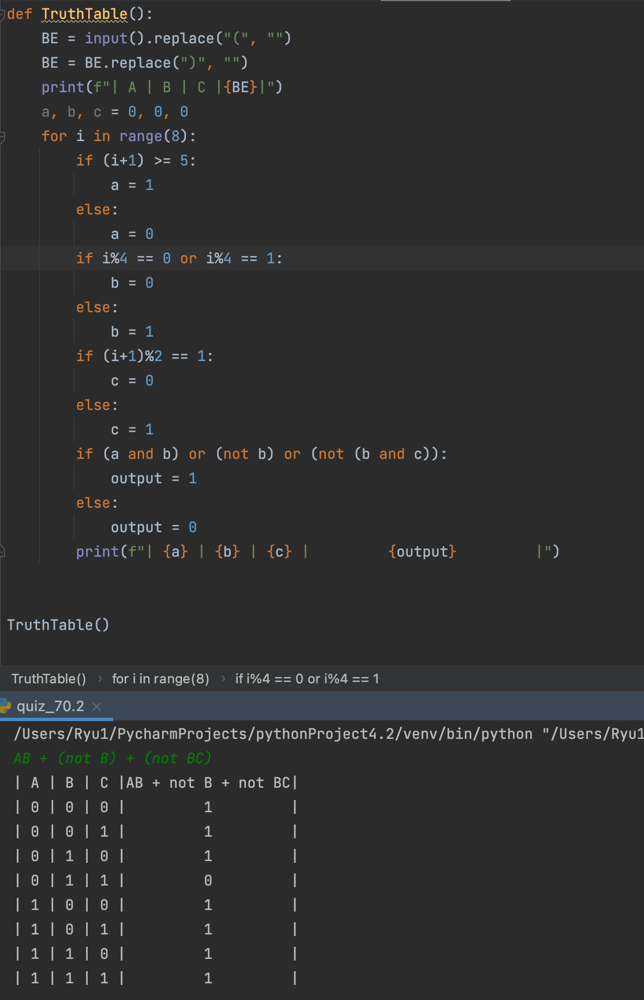

### Boolean

```.py
def TruthTable():
    BE = input().replace("(", "")
    BE = BE.replace(")", "")
    print(f"| A | B | C |{BE}|")
    a, b, c = 0, 0, 0
    for i in range(8):
        if (i+1) >= 5: # converts the input into binary depending on digit
            a = 1
        else:
            a = 0
        if i%4 == 0 or i%4 == 1: # converts the input into binary depending on digit
            b = 0
        else:
            b = 1
        if (i+1)%2 == 1:
            c = 0
        else:
            c = 1
        if (a and b) or (not b) or (not (b and c)): # converts the input into binary depending on digit
            output = 1
        else:
            output = 0
        print(f"| {a} | {b} | {c} |         {output}         |")


TruthTable()
```


