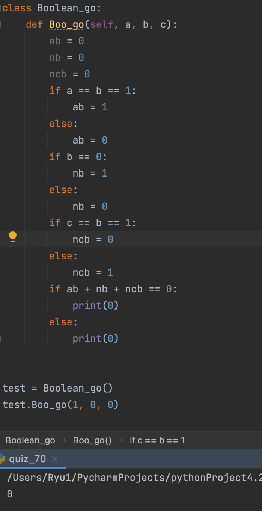

### Boolean

```.py
class Boolean_go:
    def Boo_go(self, a, b, c):
        ab = 0
        nb = 0
        ncb = 0
        if a == b == 1:
            ab = 1
        else:
            ab = 0
        if b == 0:
            nb = 1
        else:
            nb = 0
        if c == b == 1:
            ncb = 0
        else:
            ncb = 1
        if ab + nb + ncb == 0:
            print(0)
        else:
            print(0)
```


