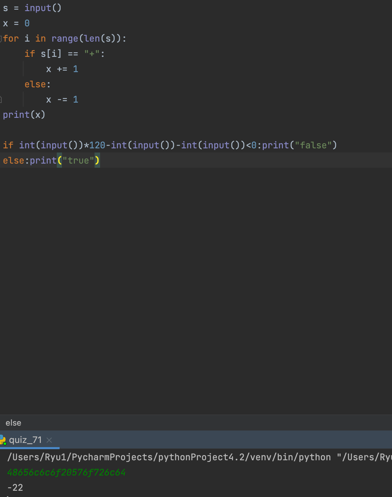

### Create a class that converts a stream of hexadecimal digits to a ascii string 

```.py
s = input()
x = 0
for i in range(len(s)):
    if s[i] == "+":
        x += 1
    else:
        x -= 1
print(x)

if int(input())*120-int(input())-int(input())<0:print("false")
else:print("true")
```


